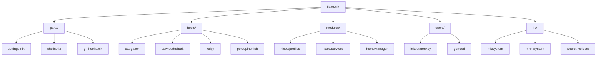

# 🌌 NixOS Configuration

A structured, reproducible NixOS configuration managed with **Flakes**, **Home Manager**, and **SOPS** for secret management. This repository utilizes `flake-parts` for a modular architectural approach.

## 🏗️ Architecture

The configuration is organized into logical components to ensure scalability and maintainability.

### Directory Structure

| Path | Description |
| :--- | :--- |
| `flake.nix` | Main entry point using `flake-parts`. |
| `lib/` | Core library with `mkSystem`, `mkPiSystem`, and secret path helpers. |
| `hosts/` | Machine-specific configurations and hardware definitions. |
| `users/` | User definitions and integrated **Home Manager** configurations. |
| `modules/` | Reusable NixOS modules and feature-based **Profiles**. |
| `parts/` | Flake modules for settings, dev shells, and CI checks. |
| `pkgs/` | Custom package expressions. |
| `secrets/` | SOPS secret definitions (points to an external private repository). |

## 🚀 Workflows

This repository uses [just](https://github.com/casey/just) to automate common tasks.

### Local Management
- `just build`: Build the configuration for the current host without switching.
- `just switch`: Rebuild and apply the configuration to the local machine (uses `nh`).
- `just fmt`: Format all Nix files using `nixfmt`.

### Remote Deployment
- `just deploy <hostname>`: Deploy the configuration to a remote host (e.g., `kelpy`, `porcupineFish`).
  - Example: `just deploy porcupineFish`

### Maintenance
- `just update`: Update all flake inputs.
- `just check`: Run all flake checks and git hooks.

## 🔐 Secrets Management

We use **SOPS-nix** for managing sensitive data. Secrets are stored in an external private repository linked as a flake input (`secrets`).

### Key Helpers
The `lib` module provides several helpers to resolve secret paths:
- `getSecretFile "name"`: Resolves to `secrets/profiles/name.yaml`.
- `getHostSecretFile "host"`: Resolves to `secrets/hosts/host/secrets.yaml`.
- `getUserSecretFile "user"`: Resolves to `secrets/users/user.yaml`.

This ensures that secret paths are standardized and easy to reference across modules.

## 🛠️ Implementation Details

### Modular Profiles
Profiles in `modules/nixos/profiles` encapsulate features (e.g., `desktop`, `gaming`, `ai`). Hosts import these from `self.nixosProfiles`.

### Specialized Library
- **`mkSystem`**: Standard helper for x86_64 NixOS systems.
- **`mkPiSystem`**: Specialized helper for Raspberry Pi hosts, managing SD card image creation and specific firmware requirements via `nixos-raspberrypi`.

### User Integration
Users are exposed as NixOS modules via `self.users.[username]`. Importing a user module automatically:
1. Creates the system-level account.
2. Applies the corresponding Home Manager configuration.
3. Sets up SSH keys and identity profiles.
